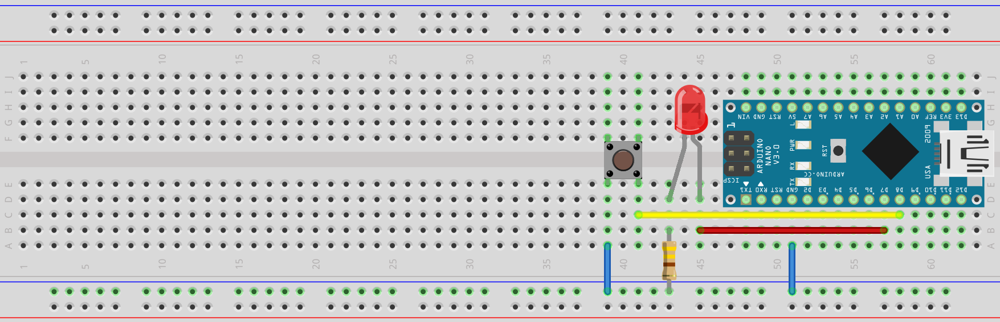
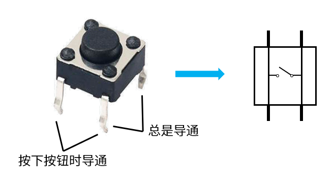
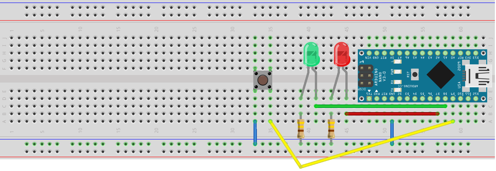

# 第4节：从输出到输入

在上一个实验中，我们已经看到了程序控制与真实世界的电路交互的一个例子。但是，像之前的实验一样，仅仅是点亮几个LED是远远不够的。点亮LED的过程，其实就是输出的过程。而我们知道，一个完整的系统，不可能仅仅有输出，而是要同时有输入和输出才行。因此，这一节的实验，我们就要尝试如何进行输入。

## §4.1 电路连接

我们要连接的电路如下图。



和上一节实验的电路相比，电路图上多出了一个轻触按钮开关，开关的一端连接至电源负极，另一端通过黄色导线连接至Arduino的D8引脚。在连接轻触开关时，需要注意开关的朝向和安放方法，这里先介绍一下轻触开关的结构，如图。



简单来说，就是按钮长边上的两个引脚之间总是导通，短边上的两个引脚之间只在按钮按下时导通。对于上面的电路，就是当按钮按下时，D8引脚将会通过按钮导通至电源负极，输入为低电平；当按钮未按下时，D8引脚并未连接至任何地方，处于“悬空”状态。

安装按钮时，将按钮的长边对齐面包板中间的凹槽按放，则尺寸正好允许四个引脚接入插孔，安装后再次轻按以确保按钮已固定在面包板上，防止接触不良。

## §4.2 编写并上传程序

下面给出我们将要运行的程序：【src/chap4\_code1\_button/chap4\_code1\_button.ino】


```arduino
void setup() {
  pinMode(8, INPUT_PULLUP);     // 将D8引脚设置为输入上拉模式，以接受按钮输入
  // 输入上拉模式INPUT_PULLUP是一种特殊的输入模式
  // 在这个模式下，引脚将在内部被连接到一个上拉电阻，从而在引脚悬空时能够读取到高电平，且不影响低电平的读取
  // 与之相比，当处于普通的输入模式INPUT时，若引脚悬空，则读取到的电平高低是无法预料的随机值
  pinMode(7, OUTPUT);           // D7引脚和LED相关的处理与之前的实验相同
  digitalWrite(7, LOW);
}

void loop() {
  if (digitalRead(8) == LOW) {  // 如果D8引脚输入低电平，说明按钮被按下
    digitalWrite(7, HIGH);      // 闪烁LED
    delay(1000);
    digitalWrite(7, LOW);
  }
}
```


这个程序的功能是，当按钮被按下时，让LED亮一秒。

* pinMode的新模式——INPUT\_PULLUP（输入上拉）：输入上拉模式是一种特殊的输入模式，在这个模式下，引脚将在内部被连接到一个上拉电阻，从而在引脚悬空时能够读取到高电平，且不影响低电平的读取。与之相比，当处于普通的输入模式INPUT时，若引脚悬空，则读取到的电平高低是无法预料的随机值。因此，为了满足按钮的特性，我们需要使用输入上拉模式来在按钮未按下，引脚悬空时，读取到稳定的高电平。
* 电平 = digitalWrite(引脚名或引脚编号)：这个函数和digitalWrite函数相对，作用是读取对应引脚当前从外界输入的电平，并将其作为返回值返回给你的程序。你可以把这个值存在变量里，也可以直接对它进行判断。

接下来，按照第一节实验中同样的过程，将代码上传到Arduino，此时LED应该处于熄灭状态。按下按钮，如果一切正常，你将会看到LED开始闪烁。


如果没能成功，请再次检查接线、引脚以及代码是否和教程一致。如果你不能确定问题，请向我们反馈。


## §4.3 _更进一步_

任务：设计一个双灯电路，并为其编写程序。初始状态下，其中一个LED亮，另一个熄灭，在每次按下按钮的时候，之前亮的LED熄灭，之前熄灭的LED亮起。在这个电路中，你需要用到两个LED和两个电阻。



【剧透警告！！！】



参考电路：





参考代码：[【src/chap4\_code2\_toggle/chap4\_code2\_toggle.ino】](https://www.jianguoyun.com/p/DQpVhxQQmcGwBxjsjpsE)


```arduino
int current = 8;                // 存储当前点亮的LED所对应的引脚

void setup() {
  pinMode(9, INPUT_PULLUP);     // 将D9引脚设置为输入上拉模式，以接受按钮输入
  pinMode(8, OUTPUT);           // D7、D8引脚和LED相关的处理与之前的实验相同
  pinMode(7, OUTPUT);
  digitalWrite(8, HIGH);        // 初始状态下，D8引脚连接的LED亮
  digitalWrite(7, LOW);
}

void loop() {
  if (digitalRead(9) == LOW) {  // 如果按钮被按下
    if (current == 8) {
      digitalWrite(8, LOW);     // 切换点亮的LED
      digitalWrite(7, HIGH);
      current = 7;              // 更新存储的引脚
    }
    else if (current == 7) {
      digitalWrite(8, HIGH);    // 切换点亮的LED
      digitalWrite(7, LOW);
      current = 8;              // 更新存储的引脚
    }
    delay(1000);                // 等待1秒以防止重复触发切换
  }
}
```



