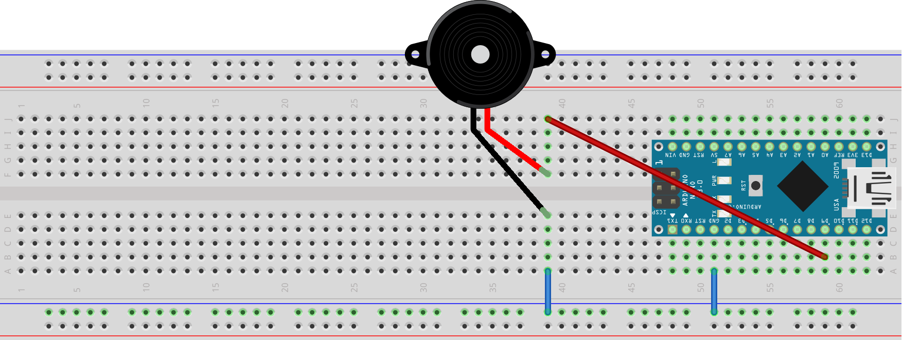

# 第7节：发出声音——蜂鸣器的驱动

从这个实验开始，我们将重点介绍Arduino和外设的交互。在真实的使用环境中，Arduino显然不可能只使用LED、按钮就能完成所有的工作，而是需要和其他外设配合。

一些外设（比如继电器）比较简单，只需要使用数字形式的信号（高低电平）就能驱动，控制方法和LED没有本质区别。但另一些外设需要比较特殊的驱动手段，比如我们这次的蜂鸣器，就是这样一个例子。

一旦掌握了一种外设的驱动方法，我们就可以举一反三，通过其他外设的文档，以及我们的经验和理解，快速掌握其他外设的驱动方法。


## §7.1 电路连接

本次实验的电路如图：



注意真实的蜂鸣器和示意图中的蜂鸣器有所不同，真实的蜂鸣器的两个引脚固定在蜂鸣器地步，直接横跨面包板中间凹槽插在面包板上即可。


## §7.2 编写并上传程序

本次实验的代码如下：[【src/chap7_code1_beeper/chap7_code1_beeper.ino】](https://www.jianguoyun.com/p/DQpVhxQQmcGwBxjsjpsE)


```arduino
void setup() {
  pinMode(9, OUTPUT);   // D9引脚设置为输出模式
}

void loop() {
  tone(9, 1000);        // 在D9引脚输出1000Hz的波形，从而使蜂鸣器发出1000Hz的声音
  delay(1000);          // 持续1000ms
  noTone(9);            // 关闭D9引脚的声音波形输出
  delay(1000);          // 持续1000ms
}
```


上面的程序比较简单，用到的两个新函数都很直观：

> * `tone(引脚, 频率)`：在引脚上输出特定频率的波形，如果引脚接的是无源蜂鸣器或喇叭，即可输出相应频率的声音。注意，同一时刻只能有一个引脚发出声音，且发出声音时，D3和D11引脚的模拟输出功能会失效。
> * `noTone(引脚)`：停止引脚上波形的输出，此时所连接的蜂鸣器或喇叭会静音。

运行上述程序，应该能听到蜂鸣器一断一续的响声。


## §7.3 _更进一步_

任务：关于蜂鸣器，其实并没有更多复杂的用法了，不过，本次任务中，你可以试着用这个蜂鸣器播放一段音乐，下面的程序是一个简单的示例，你也可以修改程序的内容以播放你自己喜欢的音乐。

提示：你可以参考《音符和频率对应关系表》。

参考电路：本次实验的电路和上文相同。

参考代码：[【src/chap7_code2_music/chap7_code2_music.ino】](https://www.jianguoyun.com/p/DQpVhxQQmcGwBxjsjpsE)


```arduino
// 代码来自 https://blog.csdn.net/m0_37738838/article/details/95062958

#define NTD0 -1
#define NTD1 294
#define NTD2 330
#define NTD3 350
#define NTD4 393
#define NTD5 441
#define NTD6 495
#define NTD7 556

#define NTDL1 147
#define NTDL2 165
#define NTDL3 175
#define NTDL4 196
#define NTDL5 221
#define NTDL6 248
#define NTDL7 278

#define NTDH1 589
#define NTDH2 661
#define NTDH3 700
#define NTDH4 786
#define NTDH5 882
#define NTDH6 990
#define NTDH7 112
//列出全部D调的频率
#define WHOLE 1
#define HALF 0.5
#define QUARTER 0.25
#define EIGHTH 0.25
#define SIXTEENTH 0.625
//列出所有节拍
int tune[]=                 //根据简谱列出各频率
{
  NTD3,NTD3,NTD4,NTD5,
  NTD5,NTD4,NTD3,NTD2,
  NTD1,NTD1,NTD2,NTD3,
  NTD3,NTD2,NTD2,
  NTD3,NTD3,NTD4,NTD5,
  NTD5,NTD4,NTD3,NTD2,
  NTD1,NTD1,NTD2,NTD3,
  NTD2,NTD1,NTD1,
  NTD2,NTD2,NTD3,NTD1,
  NTD2,NTD3,NTD4,NTD3,NTD1,
  NTD2,NTD3,NTD4,NTD3,NTD2,
  NTD1,NTD2,NTDL5,NTD0,
  NTD3,NTD3,NTD4,NTD5,
  NTD5,NTD4,NTD3,NTD4,NTD2,
  NTD1,NTD1,NTD2,NTD3,
  NTD2,NTD1,NTD1
};
float durt[]=                   //根据简谱列出各节拍
{
  1,1,1,1,
  1,1,1,1,
  1,1,1,1,
  1+0.5,0.5,1+1,
  1,1,1,1,
  1,1,1,1,
  1,1,1,1,
  1+0.5,0.5,1+1,
  1,1,1,1,
  1,0.5,0.5,1,1,
  1,0.5,0.5,1,1,
  1,1,1,1,
  1,1,1,1,
  1,1,1,0.5,0.5,
  1,1,1,1,
  1+0.5,0.5,1+1,
};
int length;
int tonepin=8;   //得用6号接口
void setup()
{
  pinMode(tonepin,OUTPUT);
  length=sizeof(tune)/sizeof(tune[0]);   //计算长度
}
void loop()
{
  for(int x=0;x<length;x++)
  {
    tone(tonepin,tune[x]);
    delay(500*durt[x]);   //这里用来根据节拍调节延时，500这个指数可以自己调整，在该音乐中，我发现用500比较合适。
    noTone(tonepin);
  }
  delay(2000);
}
```

